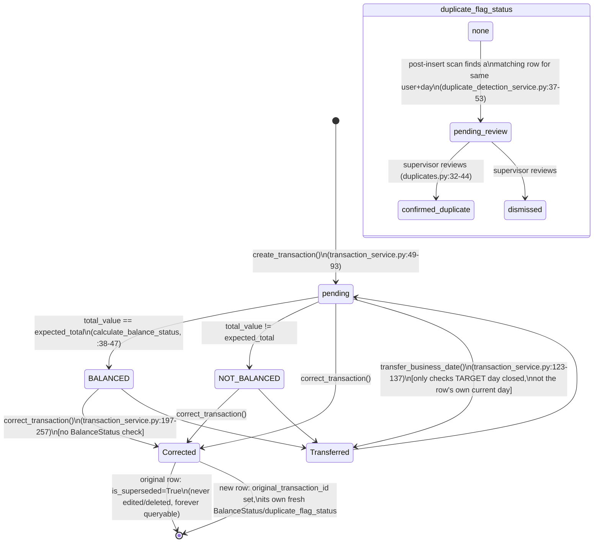

# 01 — Transaction Integrity and Concurrency (Phase 1, Agent 1)

Date: 2026-08-22
Scope: read-only investigation. No application code, tests, or config were modified — only this file was written. See `00_baseline.md` §2 for the confirmed domain mapping (bag → `Transaction.bag_number`, batch → EOD closure, reversal → `correct_transaction`) used throughout.

## 1. Current transaction lifecycle

A `Transaction` row is created once, is (mostly) never edited, and can gain exactly one correction. Two independent status fields ride on the same row: `BalanceStatus` (cash-count reconciliation) and `duplicate_flag_status` (fraud/data-entry-error review). Neither ever gates the other, and neither ever gates mutation — see Finding C-3 / H-4 below.



Who can transition what (enforced in `backend/api/deps.py` role dependencies, mirrored in `web/deps.py`):

| Transition | Who | Enforced where |
|---|---|---|
| Create transaction | any authenticated user (cashier+) | `CurrentUser`/`WebCurrentUser` — `transactions.py:12-17`, `transaction_entry_web.py:328-333` |
| List / view transactions | supervisor+ (API); supervisor+ for the list, any user for single detail | `SupervisorOrAbove` (`transactions.py:27-30`), `CurrentUser` for detail (`transactions.py:54-59`) |
| Transfer business_date (single/bulk/cashier) | admin only | `AdminOnly` — `transactions.py:67-73`, `transactions_web.py:88-127,174-183` |
| Correct transaction | supervisor+ | `SupervisorOrAbove` — `transactions_web.py:218-254` (no equivalent REST endpoint exists — correction is web-only) |
| Review duplicate flag | supervisor+ | `SupervisorOrAbove` — `duplicates.py:32-38` |
| Close / reopen EOD day | close: supervisor+; reopen: admin only | `eod.py:11-16` (close), `:25-30` (reopen) |

Note: `TransactionService.correct_transaction` is only reachable from `web/routes/transactions_web.py:247-314` — there is no `backend/api/routes/transactions.py` endpoint for it (confirmed by `grep` over `backend/api/routes`: no `/correct` route). Any pure-API client (not the web UI) cannot correct a transaction at all today.

## 2. Current database transaction boundaries

**Session lifecycle** (`backend/core/database.py:56-77`): one `AsyncSession` per HTTP request, created and torn down by the `get_core_db`/`get_catalog_db` FastAPI dependency generators:

```python
async def get_catalog_db(code):
    async with get_catalog_sessionmaker(code)() as session:
        try:
            yield session
            await session.commit()      # only commit point
        except Exception:
            await session.rollback()
            raise
        finally:
            await session.close()
```

This is the **only** place `commit()` is called for request-driven traffic (the one other call site is `eod_scheduler.py:26`, its own equivalent boundary for the nightly job — see §2.3). Every repository method (`transaction_repository.py`, `eod_repository.py`, `duplicate_repository.py`, `AuditRepository`, `NotificationRepository`) only ever calls `await self.db.flush()`, never `commit()`. Consequently:

- **A single request = a single atomic DB transaction.** `create_transaction` (transaction_service.py:49-93) does: check EOD open → validate customer/location → insert `Transaction` + `Denomination` rows (repo `create`, flushes at :48 and :59) → write an `AuditLog` row (:83-86) → re-fetch → run `DuplicateDetectionService.check_for_duplicate` which may insert a `DuplicateFlag` + `Notification` and flip `duplicate_flag_status` on up to two rows (:88-92). All of this shares the one request-scoped session and commits or rolls back together. **This is a genuine positive finding**: the business row, its denominations, the audit-log entry, and the duplicate-flag/notification side effects cannot diverge from a partial failure mid-request — confirmed by code (single session, single commit point), answering brief scenario (10) and, for the "commit succeeds but response is lost" half of scenario (5), confirming the DB-side atomicity is not the gap (the gap is the missing idempotency key on retry — see C-1).
- **No savepoints, no nested transactions, no explicit `SELECT ... FOR UPDATE` anywhere** in the codebase (confirmed by `grep -rn "with_for_update\|savepoint\|begin_nested"` over `backend/` — zero hits).
- **No row-level optimistic/pessimistic locking column** anywhere (`grep -rn "version_id_col\|version_id\b"` over `backend/models` — zero hits).

### 2.1 Read-then-write gaps inside one request

Even though a whole request is one DB transaction, several service/repository methods still do a plain `SELECT` and then, several `await` points later, an `UPDATE` — with nothing pinning the row in between:

- `TransactionRepository.update_business_date` (:63-73): `get_by_id` → mutate in Python → `flush`. No `WHERE` clause guards against a concurrently-committed change to the same row (nothing to guard against, since SQLAlchemy's session-level identity map plus autoflush=False means a second *concurrent request* — different session entirely — could commit its own change to the same row between this session's read and write).
- `TransactionRepository.set_duplicate_flag_status` / `set_superseded` (:94-104): same pattern.
- `EODRepository.close` / `reopen` (:19-57): `get_by_date` → mutate → `flush`.
- `TransactionService.correct_transaction` (:204-248): reads `original.is_superseded` at :207, then 40+ lines and several `await`s later, calls `self.repo.set_superseded(original.transaction_id)` at :248 — a second concurrent request that read the same "not yet superseded" original before either commits will pass the same check. See Finding H-3.

### 2.2 EOD close/reopen boundary

`EODService.close_day` (:23-32) is a textbook check-then-act: `is_day_closed()` (a `SELECT`) then `repo.close()` (another `SELECT` inside `EODRepository.close`, then `INSERT` or `UPDATE`). The only thing standing between two concurrent closers and two rows for the same `business_date` is the `UNIQUE` index on `eod_closures.business_date` (`alembic_catalog/versions/b17cb77d7715_eod_and_business_date.py:35`; mirrored in the model at `backend/models/eod.py:19`). See Finding H-1 for what happens when that constraint actually fires.

### 2.3 EOD scheduler boundary

`eod_scheduler.py:auto_close_all_catalogs()` (:17-33) opens its own session per catalog via `async with sessionmaker() as session`, calls `EODService.close_day`, and explicitly commits/rolls back itself — a second, independent transaction boundary outside the request-dependency pattern, but still session-scoped and properly closed via the `async with` context manager. This runs once nightly per catalog (`backend/main.py:45-49`, `CronTrigger(hour=0, minute=0)`) and races against any supervisor manually closing the same day at the same moment — same TOCTOU as §2.2, same reliance on the unique index, and it explicitly expects and swallows the `ValueError` from `is_day_closed` (eod_scheduler.py:27-30) — but **not** an `IntegrityError` from the race itself, which would hit the `except Exception: rollback(); raise` branch (:31-33) and propagate out of the scheduled job (APScheduler would log it as a failed job execution but the process keeps running — no data corruption, but a silent operational miss with no alerting visible in this codebase).

## 3. Root cause: the `SAWarning: garbage collector is trying to clean up non-checked-in connection` warnings

Confirmed by reading `pytest.ini`, `tests/conftest.py`, and the installed `pytest-asyncio==0.24.0` plugin source (`_preprocess_async_fixtures`/`_get_marked_loop_scope` in `pytest_asyncio/plugin.py`):

- `pytest.ini:3-4` sets `asyncio_mode = auto` and `asyncio_default_fixture_loop_scope = session`. The second setting **only** controls the event loop used for async **fixtures** (`app`, `tokens`, `api_client`, `web_client` in `tests/conftest.py`) — pytest-asyncio 0.24.0 has no `asyncio_default_test_loop_scope` option at all (confirmed: `pytest_addoption` in the plugin only registers `asyncio_mode` and `asyncio_default_fixture_loop_scope`).
- In `auto` mode, every `async def test_...` is auto-marked `@pytest.mark.asyncio` with no explicit scope, and `_get_marked_loop_scope` defaults an unscoped marker to `"function"`. So **every individual test function runs in its own fresh, function-scoped event loop**, while the `app` fixture — and with it `backend.core.database.core_engine` / `_catalog_engines` and their connection pools, created once at session-fixture setup (`backend/core/database.py:22-49`, imported inside the session-scoped `app` fixture in `tests/conftest.py:39-57`) — was built against the **session**-scoped loop.
- SQLAlchemy's async connection pool (`AsyncAdaptedQueuePool`) binds its internal async primitives to whichever event loop is running the first time a connection is checked in/out. A pool built against the session loop, then used from a series of different per-test function loops, cannot cleanly check connections back in once a test's own loop is torn down at the end of that test — the checked-out `aiosqlite` connection is orphaned rather than returned to the pool. When Python's GC later collects that orphaned wrapper (during some *unrelated* later test — which is exactly why the captured tracebacks in `00_baseline.md`'s saved pytest output point at unrelated code like `starlette/applications.py:113` or `jinja2/nodes.py:140`, not at the code that actually leaked it), SQLAlchemy's pool finalizer fires this warning.
- **Confirmed**: the event-loop-scope mismatch (fixture loop = session, test loop = function, no ini option in this pytest-asyncio version to align them) and that this is the documented mechanism for this exact warning class.
- **Assumption** (would need a live repro with pool debug logging / `tracemalloc` to nail down the exact internal failure point): the precise moment inside `AsyncAdaptedQueuePool`'s checkin path where the cross-loop handoff silently fails vs. raises-and-is-swallowed. The observable symptom and root mechanism are established either way.
- **This is a test-harness defect, not a production bug** — a real ASGI deployment (`uvicorn`/`gunicorn`) runs one long-lived event loop for the whole process lifetime, matching how `backend/core/database.py`'s module-level engines are constructed, so this specific mismatch would not occur in production. It is still directly relevant to this assessment for two reasons: (1) it demonstrates the app has **zero explicit connection-pool configuration** (`create_async_engine(..., echo=..., connect_args=...)` only — no `pool_size`, `max_overflow`, `pool_timeout`, or `pool_pre_ping` anywhere, confirmed at `database.py:22-49`), so SQLAlchemy defaults apply silently and untested; (2) it means the existing test suite provides **no coverage at all** of what happens under real concurrent DB access, because nothing in it currently exercises two requests' sessions overlapping in time against the same row (every test today is effectively sequential against the shared temp SQLite DBs). See Finding M-1.

## 4. Findings, ranked

Each finding states file:line evidence and whether it is **Confirmed** (from reading code alone) or **Assumption** (would need a live/concurrent run to fully verify).

### Critical

**C-1 — No idempotency mechanism for transaction creation or correction; client retry/double-submit creates a second, fully-accepted financial record.**
`grep -ri idempot` over the whole repository returns zero hits. `TransactionCreate` (`backend/schemas/transaction.py:24-31`) carries no client-supplied request/nonce ID, `Transaction` (`backend/models/transaction.py:20-22`) has no field for one, and `TransactionRepository.create` (`transaction_repository.py:16-61`) unconditionally inserts a new row with a fresh `uuid.uuid4()` PK every call — there is nothing to match a retried request against. The web wizard's final step, `wizard_complete` (`web/routes/transaction_entry_web.py:328-383`), POSTs once with no anti-double-submit token; a double-click, a browser auto-retry, or a client timeout-and-retry (the request's `session.commit()` at `database.py:60/72` can succeed while the HTTP response is lost on the way back to the client — brief scenario 5) all produce **two independent, fully-persisted `Transaction` rows**. Nothing blocks this — `DuplicateDetectionService.check_for_duplicate` (:37-53) only ever creates a `pending_review` *flag*, after both inserts have already committed, and only within the current request's own transaction (i.e., it can only catch a retry that lands as a genuinely separate later request, and even then only under the conditions in C-2). **Confirmed** by code (absence of any dedup mechanism + insert-only repo method). The concrete double-charge/double-count failure mode is confirmed by tracing the code path; observing it end-to-end (two concurrent POSTs racing) is an **Assumption** pending a live test, though nothing in the code could plausibly prevent it.

**C-2 — No unique constraint anywhere enforces "at most one accepted transaction for a given bag" at any scope, and the soft duplicate check is scoped to the *same user only*, so cross-user duplicate submission is invisible.**
`bag_number` (`transaction.py:29`) is `String(100), nullable=False` with **no** `unique=True` and **not even a plain index** — confirmed by reading the initial migration (`alembic_catalog/versions/7b3f53f27b9a_initial.py:48-66`: indexes are created for `created_at`, `customer_id`, `location_id`, `transaction_id`, `user_id`, but never `bag_number`) and every later migration (none add one). The only duplicate protection, `DuplicateDetectionService.check_for_duplicate` (`duplicate_detection_service.py:37-53`), calls `TransactionRepository.list_by_user_and_business_date(new_txn.user_id, new_txn.business_date, ...)` (`transaction_repository.py:81-92`) — **filtered by `user_id`**. Two *different* cashiers entering the identical `bag_number` (case/whitespace-insensitive match per `_fields_match`, :15-27) for the same customer/location/amount on the same `business_date` are never compared against each other and never flagged, confirmed or soft. **Confirmed** by code (query filter on `user_id`, absence of any index). Whether "at most one bag" is even the desired invariant is genuinely ambiguous for this domain — a bag number could legitimately recur across different business days, or (per the current model) even be split across multiple wallets/transactions for the same bag within one day by design (see `wizard_next_wallet_*` in `transaction_entry_web.py:399-438`, explicitly "each wallet still becomes its own fully independent Transaction row ... same customer/location/bag_number"). So the fix is not simply "add `UNIQUE(bag_number)`" — it needs a scoped constraint (see §6) plus a business decision on scope, but the current total absence of any DB-level constraint at any scope is the Critical-severity gap regardless of what that scope should be.

### High

**H-1 — Simultaneous EOD closure of the same `business_date`/catalog races on an uncaught `IntegrityError`, producing an unhandled 500 instead of a clean conflict response.**
`EODService.close_day` (`eod_service.py:23-32`) does `is_day_closed()` then `repo.close()`; `EODRepository.close` (`eod_repository.py:19-42`) does its own `get_by_date()` then, if none exists, `self.db.add(EODClosure(...))` + `flush()`. Two concurrent `close_day` calls (two supervisors, or a supervisor racing the nightly `auto_close_all_catalogs` job — `eod_scheduler.py:17-33`) can both pass both `SELECT`s before either commits, and both attempt to insert a row for the same `business_date`. The `UNIQUE` index on `eod_closures.business_date` (`eod.py:19`, migration `b17cb77d7715...py:35`) will reject the second `INSERT` at flush time with an `IntegrityError` — but neither `backend/api/routes/eod.py:11-22` (`close_day` route, only catches `ValueError` → 409) nor `EODService.close_day` itself catches anything but the `ValueError` it raises for the already-checked case. The `IntegrityError` propagates to `get_catalog_db`'s generic `except Exception: rollback(); raise` (`database.py:73-75`) and surfaces as an unhandled 500. **Net effect: data integrity is preserved by accident of the migration's `unique=True`, but the user-facing behavior on the losing request is an ungraceful server error, not the same clean "already closed" 409 the sequential case gets.** **Confirmed** for the racing logic, the missing catch, and the constraint that saves the data; the exact driver-level exception text/type under concurrent SQLite (`aiosqlite`) vs. the target PostgreSQL (`asyncpg`) is an **Assumption** pending a live concurrent test — worth confirming for both since the two drivers can differ in how a unique-violation surfaces (immediate at `flush()` vs. deferred to `commit()`).

**H-2 — No concurrency control (no version column, no `SELECT ... FOR UPDATE`, no advisory lock) protects any read-then-write path, so concurrent edits can silently lose an update.**
Applies uniformly to `TransactionRepository.update_business_date` (:63-73), `set_duplicate_flag_status`/`set_superseded` (:94-104), and `EODRepository.close`/`reopen` (:19-57): every one reads a row, mutates Python attributes, then flushes, with nothing pinning the row against a concurrent writer in a different session. `grep -rn "with_for_update\|version_id_col"` over `backend/` returns zero hits. Two admins concurrently calling `transfer_business_date` on the same transaction with different target dates, for example, will both succeed — whichever session commits last silently wins, with no error to either caller and no record that a race occurred (the `AuditLog`/`TRANSACTION_DAY_TRANSFERRED` entries — `transaction_service.py:179-183` — record both attempts, so the *history* is recoverable, but the live row state is a last-write-wins outcome neither admin can detect from their own response). **Confirmed** by code (absence of any locking primitive). Actually triggering and observing the lost update is an **Assumption** pending a live concurrent test — SQLite's single-writer file lock happens to serialize concurrent `flush`/`commit` calls at the OS/driver level today (masking the race under the current SQLite-only test suite), but that protection is incidental to SQLite specifically and would **not** carry over to PostgreSQL, the stated production target (`00_baseline.md` §4) — which uses row-level MVCC and would let both concurrent updates through under default `READ COMMITTED` isolation.

**H-3 — `correct_transaction` has the same TOCTOU gap on `is_superseded`, and unlike EOD close there is no unique constraint to catch a double-correction at the DB level.**
`transaction_service.py:204-248`: reads `original.is_superseded` at :207 (raises if already `True`), then performs customer/location validation and denomination-list building, then finally calls `self.repo.set_superseded(original.transaction_id)` at :248 — many `await` points after the initial read, inside the same session but with the check and the write separated. Two concurrent correction submissions for the same `original_transaction_id` (plausible in practice: a supervisor double-clicking "Save correction" on `transaction_correct.html`, since `correct_transaction_submit` in `transactions_web.py:247-314` has no anti-double-submit token either) can both read `is_superseded == False` before either commits, and both proceed to create a correction row and flip the flag. Unlike EOD's `business_date`, `original_transaction_id` (`transaction.py:66-68`) has only a **plain, non-unique** index (`alembic_catalog/versions/e3a9c6d1f480_transaction_correction.py:32-34`: `unique=False`) — there is no DB-level backstop at all here, so a successful double-correction is not merely possible but would fully commit both rows with nothing to reject the second one. **Confirmed** by code (TOCTOU shape, absence of a unique constraint on `original_transaction_id`). Whether SQLite's serialized single-writer behavior happens to mask this under the current test suite, vs. reproducing reliably on PostgreSQL, is an **Assumption** pending a live concurrent test — same caveat as H-2.

**H-4 — `BalanceStatus.balanced` (and EOD closure of the transaction's *own* business_date) never gates any mutation — a fully reconciled transaction, or one sitting inside an already-closed day, can still be transferred to a different business_date without reopening that day first.**
`grep -rn "balance_status"` over `backend/` (see §2) shows the field is only ever *computed* (`calculate_balance_status`, `transaction_service.py:38-47`) and *displayed/sorted* (`transaction_repository.py:148`, `list_filtered`'s `ORDER BY`) — it is never read as a guard anywhere. Separately, `TransactionService.transfer_business_date` (:123-137) calls `self.eod_service.is_day_closed(new_business_date)` — the **target** day — but never checks whether the transaction's **current** `business_date` is itself closed. So an admin can move a transaction *out of* an already-closed day into an open one (or between two open days, trivially) with no requirement to `reopen_day` first, silently changing the historical transaction set/total of a day that was supposed to be a fixed, closed snapshot. `bulk_transfer_business_date` (:139-157) compounds this: it checks `is_day_closed(new_business_date)` **once**, before looping over a potentially large `transaction_ids` list, so a day that closes mid-loop (via a concurrent close, or the nightly scheduler firing mid-request for a large bulk transfer) is not re-checked per row. **Confirmed** by code (the only `is_day_closed` calls are `transaction_service.py:51` on create, `:134` and `:146` on the target date of a transfer — never on origin, never on `balance_status`). Existing test coverage (`test_cannot_transfer_into_a_closed_day` in `tests/test_eod_and_transfer_api.py`) only exercises the target-day check, corroborating that the origin-day gap is untested, not just unenforced.

### Medium

**M-1 — Default, unmonitored connection-pool configuration; the test suite's `SAWarning`s are the visible symptom of zero pool-exhaustion handling anywhere in the app.**
`create_async_engine(url, echo=settings.debug, connect_args=_connect_args(url))` (`database.py:22-26,41`) sets nothing else — no `pool_size`, `max_overflow`, `pool_timeout`, `pool_recycle`, or `pool_pre_ping`. SQLAlchemy's async defaults (`AsyncAdaptedQueuePool`, `pool_size=5`, `max_overflow=10` for non-SQLite URLs) apply silently. See §3 for the root-caused test-harness leak; the substantive production-relevant gap is that there is no code path anywhere (`grep -rn "TimeoutError\|pool_timeout\|QueuePool"` over `backend/` — zero hits beyond the import-free defaults) that would gracefully handle a pool-exhaustion `TimeoutError` under real concurrent load once this moves to PostgreSQL/`asyncpg`, and no test exercises that condition. **Confirmed** (absence of configuration and handling). Actual behavior under load is an **Assumption** — this is squarely Agent 2/4 territory (load testing, pool tuning) but is flagged here since it is a direct downstream consequence of the transaction/session boundaries examined in this document.

**M-2 — `correct_transaction` is unreachable from the pure REST API — only the web UI can issue a correction.**
No route in `backend/api/routes/transactions.py` calls `TransactionService.correct_transaction`; the only caller is `web/routes/transactions_web.py:247-314`. This is not itself a concurrency bug, but it means any future API-only integration (or an automated retry/idempotency client using the REST API) has no way to correct a transaction at all today, and any idempotency-key design for corrections (§6) needs to land on both surfaces, not just the web form.

**M-3 — Automatic EOD close swallows only `ValueError`; an `IntegrityError` from the H-1 race inside the nightly job propagates out of the APScheduler job with no application-level alerting.**
`eod_scheduler.py:27-33`: `except ValueError: rollback()` (expected "already closed" case) vs. `except Exception: rollback(); raise` — the re-raised exception is not caught by anything else in this codebase; APScheduler will log a job-execution failure internally, but there is no notification, audit-log entry, or retry for a failed automatic close. Confirmed by code; whether APScheduler's own logging is sufficient in practice is an operational judgment call, not something this read-only pass can settle.

### Low

**L-1 — `Denomination` rows have no DB-level check that they sum to `total_value`; the reconciliation is purely a display-time/data-quality concern, not an enforced invariant.**
`Transaction.total_value` (`transaction.py:33`) is supplied directly by the client in `TransactionCreate.total_value` (`schemas/transaction.py:29`) and stored as-is; `TransactionRepository.create` (`transaction_repository.py:16-61`) inserts the `Denomination` rows independently with no server-side recomputation or `CHECK` constraint tying the two together. A malformed or malicious client could submit denominations that sum to a different value than `total_value`/`expected_total` and nothing would reject it (`BalanceStatus` only ever compares `total_value` to `expected_total`, never to `sum(denominations.value)`). **Confirmed** by code. Low severity because this is a data-quality gap rather than a concurrency one, and is arguably better owned by Agent 4's integrity-checker scope (per `00_baseline.md` §2's mapping table) — flagged here only because it was directly encountered while reading the create path.

**L-2 — Wizard draft state lives in the server-side cookie session (`request.session[DRAFT_KEY]`), not in the DB, so a mid-wizard crash or duplicate tab loses/duplicates in-progress (not yet committed) draft state — but never a committed `Transaction` row.**
`transaction_entry_web.py:38-46`. Since nothing is persisted to the DB until the final `wizard_complete` POST (:328-383), this cannot itself cause data corruption — it can only cause a confusing UX (two browser tabs sharing one session cookie and clobbering each other's draft), included here for completeness since it touches the same "double submission" surface as C-1 but with no integrity consequence.

## 5. Answers to the 10 required scenarios

| # | Scenario | Confirmed / Assumption | Finding(s) |
|---|---|---|---|
| 1 | Multiple users submit same bag simultaneously | **Confirmed**: no constraint blocks it; soft-flag only fires within the *same user*, so cross-user duplicates aren't even flagged (duplicate_detection_service.py:38-40). Actual concurrent race outcome (both inserts succeeding) is **Assumption** pending a live test, but nothing in the code could prevent it either way. | C-2 |
| 2 | Multiple users reuse the same transaction reference | **Confirmed**: there is no separate human-readable "reference" field — only the UUID4 PK (`transaction_id`), which is generated server-side per row and can never collide in practice; "reusing" a reference isn't a meaningful concept for this schema as built. The real analog — resubmitting a logically-identical transaction (same bag/customer/amount) — is C-1/C-2. | C-1, C-2 |
| 3 | Two users update the same record from stale versions | **Confirmed**: no version column, no locking, on every mutation path (`update_business_date`, `set_superseded`, `set_duplicate_flag_status`, EOD `close`/`reopen`). Actual lost-update outcome is **Assumption** pending a live concurrent test; SQLite's file-level write serialization currently masks it, PostgreSQL would not. | H-2, H-3 |
| 4 | Two users complete the same EOD/batch simultaneously | **Confirmed**: TOCTOU race in `close_day`, backstopped only by the `eod_closures.business_date` unique index, whose `IntegrityError` is uncaught → unhandled 500 for the loser. **Assumption**: exact exception surfacing under concurrent SQLite vs. asyncpg. | H-1 |
| 5 | Request commits but response is interrupted | **Confirmed**: the DB-side commit is atomic (single session, single commit point — §2), so a lost response never leaves partial data; but there is nothing to let the client know it already succeeded, so the natural client reaction (retry) triggers C-1. | C-1 |
| 6 | Client retries the same request | **Confirmed**: no idempotency key anywhere (`grep -ri idempot` = 0 hits repo-wide); a retried `create_transaction` or `correct_transaction` call is indistinguishable from a genuinely new one and creates a second row. | C-1, H-3 |
| 7 | Completed record modified through every available interface | **Confirmed**: `BalanceStatus.balanced` never gates anything (H-4); the original row's core financial fields (`total_value`, `expected_total`, denominations) are indeed never editable through any interface once created (no PUT/PATCH/DELETE route exists for `Transaction` anywhere — confirmed by `grep` over `backend/api/routes` and `web/routes`, only `POST .../transfer` and `POST .../correct` mutate existing rows) — that part of "append-only" holds. But `business_date` and `duplicate_flag_status` remain freely mutable regardless of `BalanceStatus` or the row's own EOD-closed state. | H-4 |
| 8 | Reversal/correction submitted twice | **Confirmed**: `is_superseded` check-then-set TOCTOU (H-3), with no unique constraint on `original_transaction_id` to catch it at the DB level (unlike EOD's business_date). **Assumption**: reproducing the double-commit live, and whether it reproduces differently under SQLite vs. PostgreSQL. | H-3 |
| 9 | Worker restarts mid-transaction | **Confirmed** (by construction, not by killing a live process): since repositories only `flush()` and the dependency generator is the sole `commit()` point (§2), an uncommitted transaction is simply rolled back by the DB on connection loss/process death — no partial `Transaction`/`Denomination`/`AuditLog` state can persist. This is a positive finding, not a gap. The unanswered half — whether the *client* can tell the difference between "crashed before commit" (safe to retry) and "crashed after commit, before response" (unsafe to retry, → C-1) — is exactly scenario 5/6 again, and the answer is "no, it cannot," which is C-1's failure mode. | (none new — see C-1) |
| 10 | Transient DB error during a safe retry | **Confirmed**: no retry logic exists anywhere in the service/repository layers (`grep -rn "retry\|Retrying\|backoff"` over `backend/services` and `backend/repositories` — zero hits) — a transient error simply propagates as a 500 to the caller, who must retry the whole request themselves, landing back on C-1 (no idempotency key to make that retry safe). | C-1 |

## 6. Required database constraints

1. **Idempotency backstop for creation/correction** (supports C-1, scenarios 5/6/9/10): a new `idempotency_keys` table — `(key TEXT PRIMARY KEY, catalog TEXT, scope TEXT, request_fingerprint TEXT, transaction_id UUID NULLABLE, created_at, expires_at)` — checked-and-inserted in the *same* DB transaction as the `Transaction` insert (so it commits/rolls back atomically with it, preserving the atomicity already established in §2). A duplicate key within the scope returns the original result instead of creating a new row.
2. **Scoped bag-uniqueness constraint** (supports C-2) — *pending the business decision on scope noted in C-2* — most likely `UNIQUE(customer_id, location_id, business_date, bag_number)` (allows the same bag to legitimately recur on a different day, or for a different customer, but not twice for the same customer/location/day) — but explicitly **not** a bare `UNIQUE(bag_number)`, since the wizard's own "next wallet, same bag" flow (`transaction_entry_web.py:399-438`) intentionally creates multiple `Transaction` rows sharing one `bag_number` within a single day. This needs explicit product sign-off before implementation, since it changes accepted behavior (today's soft-flag-and-allow becomes a hard reject) — flagged as a design decision, not just a migration, for Phase 3.
3. **`UNIQUE` on `transactions.original_transaction_id`** (supports H-3) — mirrors the protection `eod_closures.business_date` already has; guarantees at most one live correction per original row at the DB level regardless of application-level race conditions. (A `WHERE original_transaction_id IS NOT NULL` partial unique index, if the target dialect supports it, to avoid every NULL colliding — SQLite and PostgreSQL both support partial/filtered unique indexes via `sqlite_where`/`postgresql_where` in SQLAlchemy.)
4. **`CHECK` (or application-level trigger) that `sum(denominations.value) == total_value`** (supports L-1) — lower priority, likely owned jointly with Agent 4's integrity-checker scope per the baseline mapping table.

## 7. Required idempotency design

- **Client-supplied `Idempotency-Key` header** on `POST /api/v1/transactions/` and the (currently missing, per M-2) correction endpoint, and a matching hidden form nonce for the two web-form equivalents (`wizard_complete`, `correct_transaction_submit`) — generated once per browser-side draft/form-render and carried through resubmits (a page refresh gets a *new* nonce; a double-click or automatic retry of the *same* form POST carries the *same* nonce).
- **Server-side check-and-insert against the new `idempotency_keys` table (§6.1) inside the same request-scoped session**, before the `Transaction` insert: if the key is already present for this scope, return the previously-created transaction (200, not 201) instead of creating a new one; if absent, insert the key row and the transaction row together, so both commit or both roll back as one unit — this slots directly into the existing single-session-per-request boundary (§2) with no architectural change needed, only new repository/service code.
- **Key lifetime**: a bounded expiry (e.g. 24–48h) is enough to cover realistic client retry windows without growing the table unboundedly; expired keys can be purged by a periodic job (the existing `eod_scheduler`/APScheduler infrastructure is already in place to host one).
- **Scope the key to (catalog, endpoint, key)** — since each catalog is a physically separate database (`backend/core/catalogs.py`, `database.py:39-49`), the idempotency table must live per-catalog DB (alongside `Transaction`), not in the core DB, or a cross-catalog key collision becomes possible.

## 8. Recommended concurrency-control strategy

**Recommendation: optimistic locking via a `version_id_col` on `Transaction` and `EODClosure`, not `SELECT ... FOR UPDATE`.**

Justification, specific to this codebase and its stated production target (PostgreSQL via `asyncpg`, not yet exercised per `00_baseline.md` §4):

- **SQLite, the current dev/test database for all 5 DBs, does not meaningfully support `SELECT ... FOR UPDATE`** — SQLite has no row-level locking at all; it serializes writers at the whole-database/file level (`connect_args={"check_same_thread": False}`, `database.py:11`, is the only SQLite-specific tuning present, and it doesn't change this). A `with_for_update()` call would either be silently ignored or raise depending on dialect support, and would give **false confidence** in tests that pass against SQLite today but would not carry the same guarantee once PostgreSQL is actually in use — which is precisely the trap the H-2/H-3 "confirmed vs. assumption" split above is warning about. Optimistic locking, by contrast, is pure application-level logic (a `WHERE version = :expected_version` on the `UPDATE`, and a version bump) that behaves **identically** on both databases — no dialect-specific behavior to get wrong, and no need to stand up PostgreSQL in this sandbox (per baseline, not yet installed) just to validate the locking strategy.
- **Contention on any single `Transaction`/`EODClosure` row is inherently low and short-lived** in this domain — a row is written once at creation, then touched at most a handful of times afterward (one correction, occasional business-date transfers, duplicate-flag review, EOD close/reopen) by different supervisors/admins acting on different records most of the time. This is exactly the profile optimistic locking is built for (rare conflicts, cheap retry-on-conflict) rather than pessimistic locking's profile (frequent contention, where holding a lock is cheaper than repeatedly retrying). `SELECT FOR UPDATE` would also hold a lock across every `await` in the surrounding service method (customer/location validation, denomination-list building) — an unnecessarily long hold time given the async request handling here, with real risk of lock-wait pileups under load that pessimistic locking is supposed to avoid, not cause.
- SQLAlchemy's built-in `__mapper_args__ = {"version_id_col": ...}` support turns a lost-update into a raised `StaleDataError` on `flush()`/`commit()` automatically, which the service layer can catch and translate into a clean 409 — the same shape of fix already needed for H-1's uncaught `IntegrityError` (§ Finding H-1), so this reuses one error-handling pattern (`IntegrityError`/`StaleDataError` → 409) across both the insert-race (EOD close, bag uniqueness) and update-race (transfer, correction, duplicate review) cases, rather than introducing two different concurrency primitives.
- Where a true create-or-conflict scenario exists (EOD close's "does a row for this business_date already exist" and the proposed correction/bag-uniqueness constraints in §6), a `UNIQUE` constraint plus a caught `IntegrityError` remains the right, simpler tool — no version column needed there, since the conflict is about row *existence*, not row *staleness*. The two mechanisms (unique constraint for inserts, version column for updates) are complementary, not competing, and both are portable across SQLite/PostgreSQL without dialect-specific code.

## 9. Proposed automated test cases (Phase 3 — names + intent only, no implementation here)

- `test_concurrent_create_same_bag_same_user_both_succeed_and_get_flagged` — two truly concurrent (`asyncio.gather`) creates from one user/day/bag both persist; confirms C-2's soft-flag-only behavior under real concurrency, not just sequential calls.
- `test_concurrent_create_same_bag_different_users_not_flagged_at_all` — same as above but two different `user_id`s; demonstrates the cross-user blind spot in C-2 has no detection at all, not even a soft flag.
- `test_retry_same_wizard_submission_creates_two_transactions_today` — resubmits `wizard_complete` with an identical draft twice in a row; demonstrates C-1's concrete double-transaction outcome pre-fix, and (post-fix) verifies the idempotency key collapses it to one.
- `test_concurrent_eod_close_same_business_date_second_request_result` — two concurrent `close_day` calls for the same date; pins down today's actual behavior (409 vs. unhandled 500) per H-1, and post-fix verifies both dialects surface a clean 409.
- `test_concurrent_correct_transaction_same_original_both_requests` — two concurrent `correct_transaction` calls against the same `original_transaction_id`; demonstrates H-3's double-correction race and, post-fix, verifies the unique constraint/lock rejects the second.
- `test_concurrent_transfer_business_date_lost_update` — two concurrent admin transfers of the same transaction to two different target dates; demonstrates H-2's silent last-write-wins today, and post-fix verifies a `StaleDataError`/409 on the loser.
- `test_transfer_out_of_closed_eod_day_changes_closed_day_total_without_reopen` — transfers a transaction whose *own* `business_date` is already closed, to an open date, without calling `reopen_day` first; demonstrates H-4's origin-day gap.
- `test_correct_transaction_allowed_on_balanced_transaction_without_extra_guard` — documents (pending a product decision) that `BalanceStatus.balanced` today provides no extra protection against correction, per H-4.
- `test_audit_log_atomic_with_business_change_on_forced_mid_request_failure` — forces an exception after the business-row flush but before the request completes (e.g. patch `NotificationService.raise_event` to raise), asserts neither the `Transaction`/`Denomination` rows nor the `AuditLog` row are visible after rollback — turns §2's "confirmed by reading code" atomicity claim into a running regression test.
- `test_pool_exhaustion_under_concurrent_load_returns_clean_error_not_hang` — fires more concurrent `create_transaction` calls than the configured pool size against a real (non-SQLite) database; confirms M-1's gap is closed once pool tuning + timeout handling lands (primarily an Agent 2/4 test, listed here because it directly follows from this document's §3 root cause).

## 10. Files likely to require modification in Phase 3

- `backend/models/transaction.py` — add `version_id_col`, the scoped bag-uniqueness constraint (pending product sign-off, §6.2), and the `UNIQUE` index on `original_transaction_id` (§6.3).
- `backend/models/eod.py` — add `version_id_col` for the update-existing-row branch of `EODRepository.close`/`reopen` (H-2).
- New model + migration for `idempotency_keys` (§6.1, §7), one per catalog DB.
- `backend/repositories/transaction_repository.py` — version-aware updates in `update_business_date`/`set_superseded`/`set_duplicate_flag_status`; idempotency-key check-and-insert in `create`.
- `backend/repositories/eod_repository.py` — version-aware `close`/`reopen`; catch/translate `IntegrityError` from the business_date race (H-1).
- `backend/services/transaction_service.py` — idempotency-key plumbing through `create_transaction`/`correct_transaction`; re-check the *origin* `business_date`'s closed status in `transfer_business_date`/`bulk_transfer_business_date` (H-4); re-check `is_day_closed` per-row inside `bulk_transfer_business_date`'s loop, not just once up front.
- `backend/services/eod_service.py` — catch `IntegrityError`/`StaleDataError` and re-raise as the existing `ValueError` pattern so routes' current `except ValueError` handling keeps working unchanged (H-1).
- `backend/api/routes/transactions.py` — accept `Idempotency-Key` header; add the missing REST correction endpoint (M-2) so idempotency/locking fixes apply to both API and web surfaces.
- `backend/api/routes/eod.py` — map the new conflict exceptions to 409 (currently only `ValueError` is mapped).
- `web/routes/transaction_entry_web.py`, `web/routes/transactions_web.py` — per-draft/per-form idempotency nonce for `wizard_complete` and `correct_transaction_submit`; surface 409 conflicts as a form error rather than a raw 500.
- `backend/core/database.py` — explicit `pool_size`/`max_overflow`/`pool_timeout`/`pool_pre_ping` on `create_async_engine` (M-1), independent of the concurrency-control work but discovered via the same investigation.
- `alembic_catalog/versions/` — one or more new migrations for all of the above schema changes.
- `tests/` — new concurrency-focused test module (§9's proposed cases); `tests/conftest.py` and/or `pytest.ini` also need the event-loop-scope fix from §3 (`asyncio_default_fixture_loop_scope` alone is insufficient — either pin every test's `loop_scope` to match the fixtures, or make the DB engine fixtures function-scoped instead) so that a future concurrency test suite doesn't inherit the same connection-leak noise while trying to test real concurrency.
